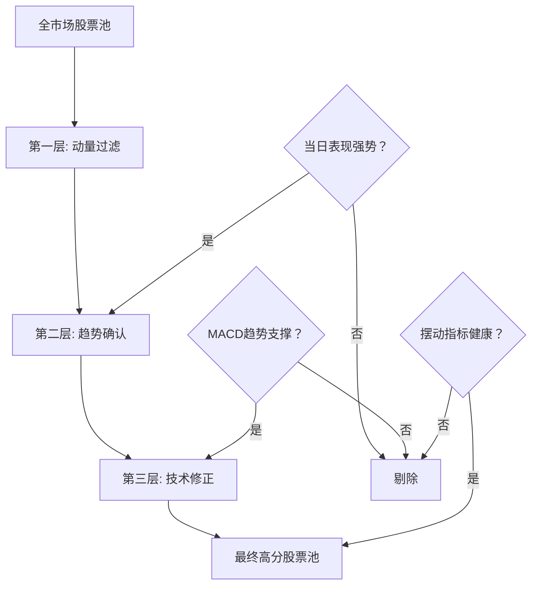

# AI Trading Scout 策略底层逻辑与交易直觉解析

**创建日期**: 2025年12月18日
**版本**: v1.0
**状态**: 核心策略逻辑已通过机器学习逆向工程验证

---

## 📋 目录

1. [策略概览](#策略概览)
2. [核心哲学](#核心哲学)
3. [交易直觉](#交易直觉)
4. [策略架构](#策略架构)
5. [关键因子解析](#关键因子解析)
6. [适用场景与市场逻辑](#适用场景与市场逻辑)
7. [风险特征](#风险特征)

---

## 🎯 策略概览

### 策略名称
**基于MACD趋势确认的复合动量策略**

### 策略本质
这是一个**"强者恒强"**的右侧追强策略，通过机器学习逆向工程从实战中验证得出。它寻找那些既有短期爆发力、又有中期趋势支撑的标的。

### 核心逻辑
```
当日动量 ✅ + 中期趋势确认 ✅ + 技术形态配合 ✅ = 高分信号
```

---

## 💡 核心哲学

### 为什么选择"强者恒强"？

**1. A股市场特性**
- 涨跌停板制度放大了动量效应
- 散户主导的市场更容易情绪驱动
- 资金集中涌入热门标的形成正反馈

**2. 动量持续性**
- A股的动量效应通常持续3-7天
- 强势股往往在短期内继续表现强势
- 符合"趋势是你的朋友"的经典投资理念

**3. 风险收益比**
- 避免左侧抄底的不确定性
- 右侧确认后进入胜率更高
- 及时识别趋势转弱的信号

---

## 🎪 交易直觉

### 第一直觉：**"看天吃饭"**
- **核心指标**: `change` (重要性: 2.83), `pct_chg` (重要性: 1.63)
- **交易逻辑**: 当天必须有明显表现，不关注潜伏股
- **直觉体现**: "今天不涨的股票，明天凭什么涨？"

### 第二直觉：**"趋势确认"**
- **核心指标**: `macd_dif_bfq` (0.99), MACD系列因子
- **交易逻辑**: 不仅要涨，还要有持续上涨的趋势基础
- **直觉体现**: "孤立的上涨不可靠，要有趋势支撑才安全"

### 第三直觉：**"位置感知"**
- **核心指标**: `topdays` (0.58), `lowdays` (0.55)
- **交易逻辑**: 知道股票处于历史走势的哪个阶段
- **直觉体现**: "是启动阶段还是末期疯狂？位置决定风险"

### 第四直觉：**"技术刹车"**
- **核心指标**: RSI、KDJ、CCI等摆动指标
- **交易逻辑**: 防止在极端情绪点盲目追高
- **直觉体现**: "再好的东西也不能太贵，技术指标就是情绪温度计"

---

## 🏗️ 策略架构

### 三层过滤系统



### 评分机制

**总分 = Σ(权重i × 因子值i)**

- **动量权重**: ~45%
- **趋势权重**: ~35%
- **修正权重**: ~20%

---

## 📊 关键因子解析

### 🚀 第一驱动力：价格动量与爆发力

| 因子 | 重要性 | 作用 | 交易意义 |
|------|--------|------|----------|
| `change` | 2.83 | 当日涨跌幅绝对值 | 捕捉短期爆发力 |
| `pct_chg` | 1.63 | 当日涨跌幅百分比 | 标准化强度衡量 |
| `pct_change` | 0.35 | 价格变化率 | 辅助确认 |

**直觉解读**: "当天必须有所表现，没有表现就没有关注价值"

### 📈 第二驱动力：趋势强度与方向

| 因子 | 重要性 | 作用 | 交易意义 |
|------|--------|------|----------|
| `macd_dif_bfq` | 0.99 | 前复权DIF线 | 趋势加速度 |
| `macd_dif` | 0.25 | 快慢线差值 | 趋势强度 |
| `topdays` | 0.58 | 距离历史高点天数 | 位置感知 |
| `lowdays` | 0.55 | 距离历史低点天数 | 周期判断 |

**直觉解读**: "不能是昙花一现，要有趋势的可持续性"

### ⚖️ 第三驱动力：摆动与反转修正

| 因子 | 重要性 | 作用 | 交易意义 |
|------|--------|------|----------|
| `rsi`系列 | 1.23 | 相对强弱指标 | 超买超卖判断 |
| `kdj`系列 | 1.21 | 随机指标 | 短期修正 |
| `cci` | 0.38 | 顺势指标 | 极端情况过滤 |
| `wr` | 0.39 | 威廉指标 | 反转信号 |

**直觉解读**: "再好的趋势也不能在极端位置买入，需要技术刹车"

---

## 🌍 适用场景与市场逻辑

### 最佳适用环境

**1. 趋势性市场**
- 牛市或结构性行情
- 板块轮动明显
- 资金流向清晰

**2. 高波动环境**
- 政策驱动行情
- 主题投资活跃
- 市场情绪高涨

**3. 技术分析有效性高的市场**
- 技术形态经典
- 技术信号自我实现
- 量化策略参与者多

### A股特殊优势

**1. T+1制度**
- 当日买入无法卖出，降低投机噪音
- 资金需要更谨慎选择标的

**2. 涨跌停限制**
- 涨停股次日往往有溢价
- 强者恒强效应被放大

**3. 散户主导**
- 情绪化交易提供动量机会
- 羊群效应创造趋势

---

## ⚠️ 风险特征

### 主要风险

**1. 震荡市磨损**
- 缺乏明确趋势时频繁发出假信号
- MACD在震荡市中容易失效
- 动量效应减弱导致胜率下降

**2. 高位反转风险**
- 在情绪高潮时给出高分
- 容易成为主力出货的接盘者
- 需要结合成交量等其他指标判断

**3. 突发事件风险**
- 纯技术面策略对基本面变化反应滞后
- 政策突变或黑天鹅事件无法预测

### 风险控制建议

**1. 市场环境过滤**
```python
if market_volatility < threshold or market_trend == sideways:
    strategy_enabled = False
```

**2. 仓位管理**
- 强趋势期：高仓位(60-80%)
- 震荡期：低仓位(20-40%)
- 风险期：空仓观望

**3. 止损机制**
- 技术止损：跌破关键支撑位
- 时间止损：持仓超过N天无表现
- 动量止损：动量指标转弱

---

## 🔮 策略展望

### 优化方向

**1. 多因子融合**
- 加入基本面因子(PE、PB、ROE)
- 结合资金流向数据
- 引入宏观经济指标

**2. 动态权重调整**
- 市场风格识别
- 因子重要性动态调整
- 自适应权重机制

**3. 机器学习增强**
- 深度学习模型替代线性组合
- 强化学习优化持仓时间
- 自然语言处理新闻情绪

### 应用场景扩展

**1. 股指期货**
- 趋势跟踪策略
- 跨品种套利

**2. 期权策略**
- 趋势确认后买入看涨期权
- 波动率交易机会

**3. 跨市场应用**
- 港股、美股适用性测试
- 量化CTA策略移植

---

## 📚 参考资料

- [Demo 1 逆向工程分析报告](../demo/demo1-逆向总分/output_full/Strategy_Attribution_Report.md)
- [特征重要性详细数据](../demo/demo1-逆向总分/output_full/feature_importance.csv)
- [潘哥数据字段解读](../demo/demo1-逆向总分/潘哥数据里面的字段解读.md)

---

**文档维护**: 此文档将根据策略迭代和市场反馈持续更新。如需修改，请联系量化研究团队。

**免责声明**: 本文档仅供研究使用，不构成投资建议。实盘交易需考虑更多现实因素，建议做好充分的风险控制。